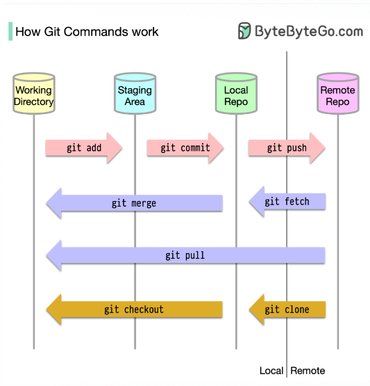

To begin with, it’s essential to identify where our code is stored. The common assumption is that there are only two locations - one on a remote server like Github and the other on our local machine. However, this isn’t entirely accurate. Git maintains three local storages on our machine, which means that our code can be found in four places:

Working directory: where we edit files

Staging area: a temporary location where files are kept for the next commit

Local repository: contains the code that has been committed

Remote repository: the remote server that stores the code
